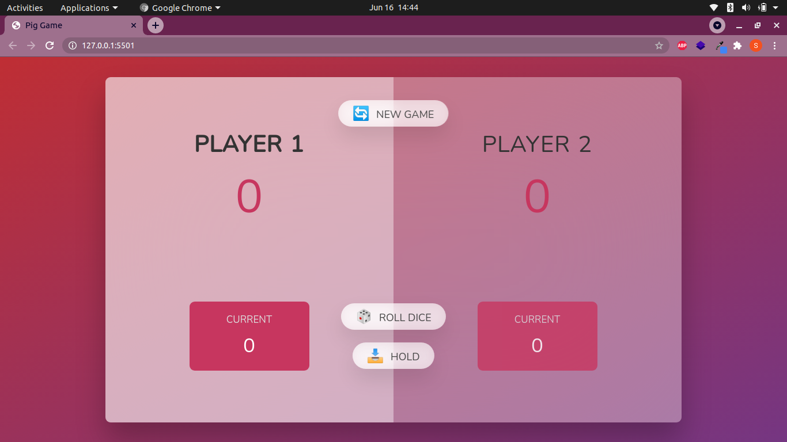
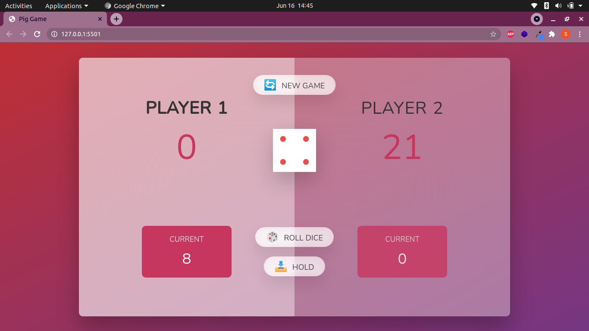
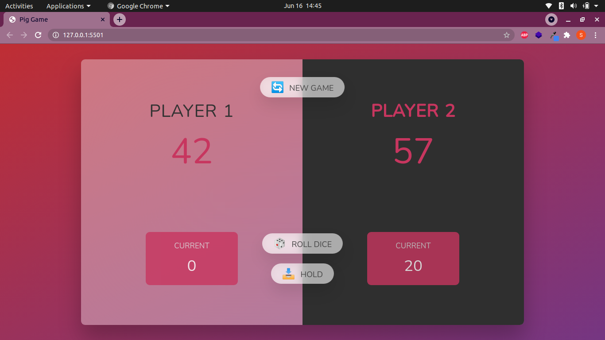

# Pick Game

Its a JS based game to roll a dice and who gets the first 50 is the winner. and 1 no is the reseter if you got it your score of that round goes back to zero .You can save your score and pass the round if you want .

<h2>Gallary</h2>

    1.	
    2.			
    3.

 
<h3>Including Functionality</h3>
	1.Switch between players		 
	2.Roll dice and add the Score			 
	3.Hold button to save the number	 
	4.New Game to reset initialization		 
	5.Again button (for working without reloading page and use highscore)

 
<h3>Installation Steps</h3>
1.clone the repo 
https://github.com/D-Jack/JS-Pick-Game-Project.git  
2.Open with Live Server 
3.Enjoy Pick Game 
